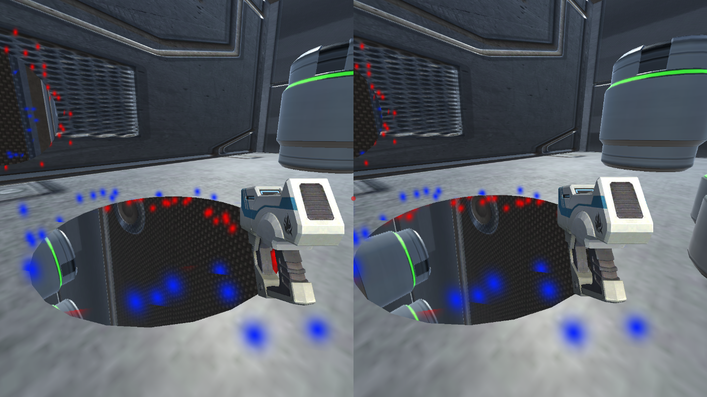

# VR Portals
Aryamaan Jain  
Unity | VR | 3D  

## Game
* World : A navigable world comprised of rooms with walls, in which you can move based on physical motion in the real world.
* Gun : Player holding a gun, shooting which creates a portal on the walls.
* Portals : We can see what lies across portals, as well as travel through them. Limited by two active portals at a time. Portals may be created on any surface - including walls, ceilings, and floors. We can go partially through a portal as well.

## Controls

* movement: `w s a d`
* jump: `space`
* shoot: `left mouse`
* exit: `Alt+Fn+F4`

## Run

1. Go to `Build` folder.
2. Double click `PortalVR.exe`.

## Screenshot

